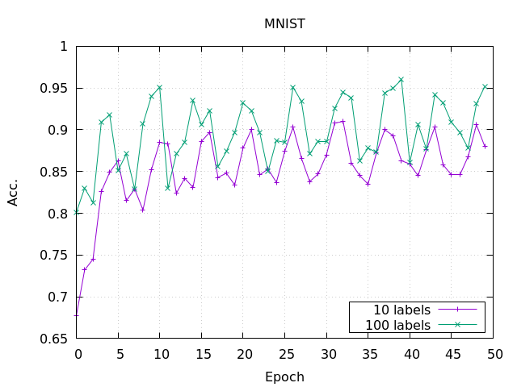

# Learning by association; Semi-supervised MNIST learning

This is an implementation of "Learning by Assocication" written with Keras.
`assoc.py` execs semi-supervised learning of MNIST.

## usage

Type `make help`.

## Result

| #labels | Acc.(%) |
|:--------|:-------:|
| 100     | 96.00   |
| 10      | 90.30   |

The paper reported accuracy 99%+ can be performed with 100 labels (https://github.com/haeusser/learning_by_association/blob/master/semisup/mnist_train_eval.py).
This project of mine couldn't achieved the accuracy...

## References

- The original paper: [[1706.00909] Learning by Association - A versatile semi-supervised training method for neural networks](https://arxiv.org/abs/1706.00909)
- Source code by them: [https://github.com/haeusser/learning_by_association](https://github.com/haeusser/learning_by_association)
- 日本語の解説: [https://github.com/arXivTimes/arXivTimes/issues/352](https://github.com/arXivTimes/arXivTimes/issues/352)
